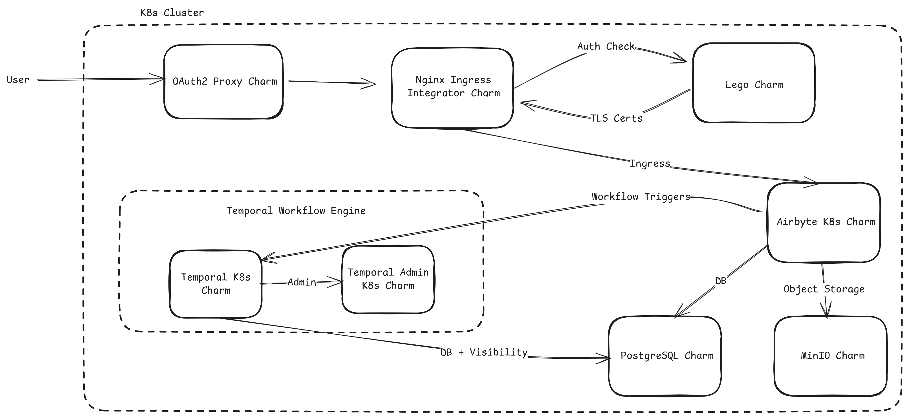

# Charmed Airbyte Architecture

The Charmed Airbyte ecosystem consists of a number of different charmed operators related together. The diagram below shows a high-level illustration of the different charms and their communication.

## Component Descriptions

### Airbyte-k8s

The Airbyte-k8s charm is the core component that runs the server, scheduler, and API. It uses MinIO as its object storage backend and relies on a PostgreSQL database for persistent data. The charm integrates with OAuth2 Proxy to provide authentication capabilities, stores blobs, logs, and state in MinIO, and exposes its services through a nginx ingress integrator.

### OAuth2 Proxy

The OAuth2 Proxy charm protects Airbyte by providing authentication through various OAuth providers such as Google OAuth, GitHub OAuth, or other SSO solutions. It acts as a reverse proxy sitting in front of Airbyte and is exposed through the same nginx ingress integrator that serves Airbyte itself.

### Nginx Ingress Integrator

A single instance of the Nginx Ingress Integrator handles traffic for both Airbyte and OAuth2 Proxy. This ingress controller manages HTTP routing, performs TLS termination when a TLS secret is configured, enforces source-range allowlists for security, and handles timeout configuration for long-running requests.

### MinIO

MinIO serves as the object storage backend for Airbyte, providing a scalable solution for storing state information, large log files, and job artifacts generated during data synchronization operations.

### Temporal-k8s

Temporal-k8s is the orchestration engine that powers Airbyte's workflow execution. It handles job execution, manages retries for failed operations, coordinates scheduling of synchronization tasks, and orchestrates long-running sync pipelines to ensure reliable data movement.

### Temporal Admin

The Temporal Admin charm provides administrative capabilities for the Temporal workflow engine, including namespace administration and workflow debugging tools to help monitor and troubleshoot synchronization operations.
