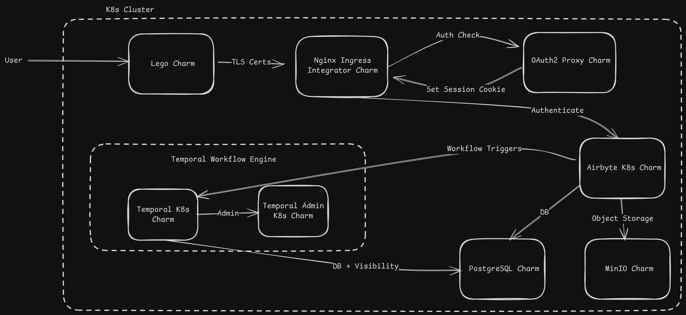

# Charmed Airbyte Architecture

The Charmed Airbyte ecosystem consists of a number of different charmed operators related together. The diagram below shows a high-level illustration of the different charms and their communication. The components are as follows:

# Component Descriptions

### Airbyte-k8s
* Runs the server, scheduler and API.
* Uses MinIO as object storage.
* Uses a PostgreSQL database (DBaaS).
* Integrates with:
  * OAuth2 Proxy for authentication
  * MinIO for blobs, logs, state
  * Ingress via the first nginx ingress integrator

### OAuth2 Proxy
* Protects the Airbyte behind Google OAuth / GitHub OAuth / SSO.
* Acts as a reverse proxy for the Airbyte.
* Exposed through the same nginx ingress integrator as Airbyte.

### Nginx Ingress Integrator (Airbyte)
One instance for:
* Airbyte
* OAuth2 Proxy
* Certificates from Lego

This ingress handles:
* HTTP routing
* TLS termination (if Lego or a manual TLS secret is configured)
* Source-range allowlist
* Timeout configuration

### Nginx Ingress Integrator (Webhooks)
A separate ingress dedicated to the Airbyte Webhooks application.

Its purpose is to:
* Keep webhook routing isolated
* Enable different hostname/paths
* Simplify independent TLS or routing behavior

### Lego
ACME provider for TLS certificates.

It is only used if one wants Let’s Encrypt certificates. Airbyte will still work without Lego (HTTP mode or user-supplied TLS secret).

### MinIO
Its purpose is to store state, large logs (objects) and job artifacts

### Temporal-k8s

Orchestration engine powering:
* Job execution
* Retries
* Scheduling
* Long-running sync pipelines

### Temporal Admin
Provides:
* Namespace administration
* Workflow debugging tools

### Airbyte Webhooks
A separate charm:
* Receives webhook events
* Authenticates + transforms payloads
* Triggers Temporal workflows
* Uses Temporal as downstream execution engine

Exposed through its own nginx ingress integrator.